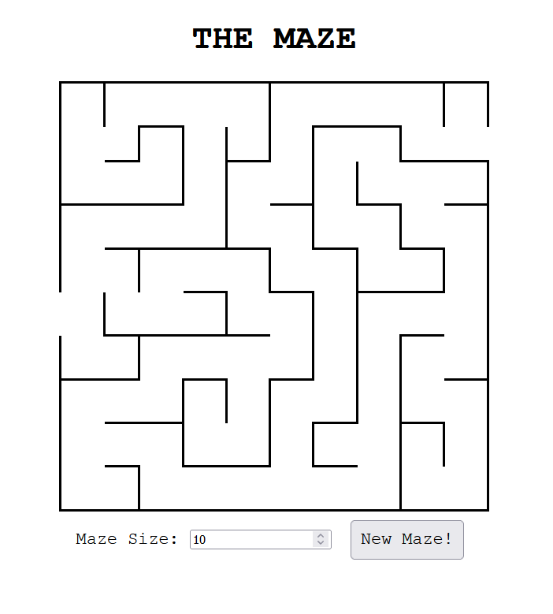

# Sam Neale Maze Challenge for Flare

# Instructions

To run, simply open index.html in a broswer window. Choose a maze size (1-100) and click New Maze
to generate a random maze.

# Implementation

The maze is treated as a grid of cells size x size large. Starting
at a random cell, one of its neighbors is chosen at random. Then the
edge between those two cells is removed, creating a path. This continues
until a cell is reached that has previously visited neighbors. Then 
the cell is removed from the visitedCells array and added to the 
closedCells array and is never visited again. The algorithm then steps
back to the previous cell and tries a different random direction. 
It terminates when the visitedCells array is empty.

